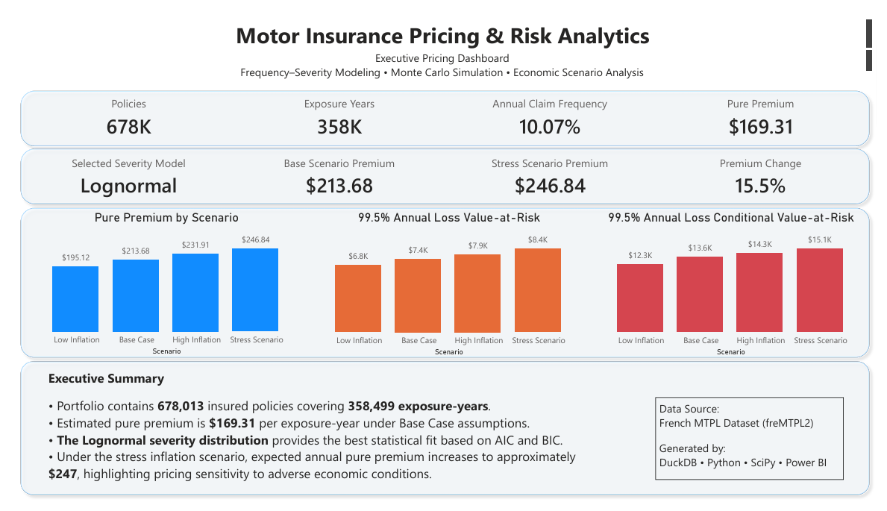
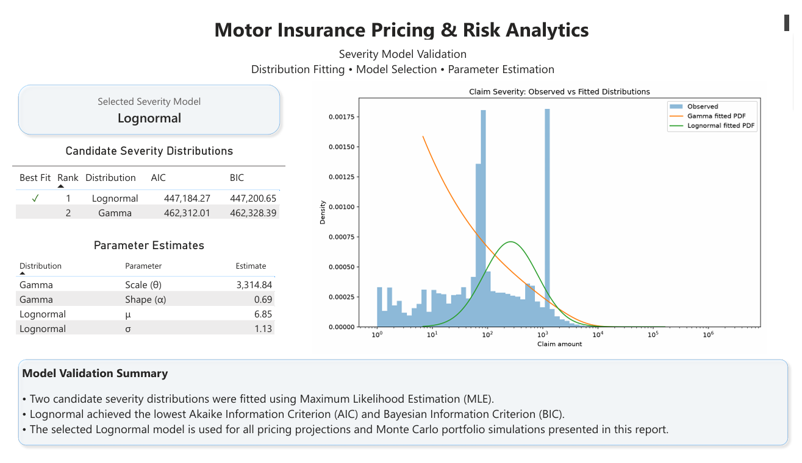

# Actuarial Motor Insurance Pricing Analytics

> **An end-to-end actuarial pricing analytics project built with DuckDB, Python, SQL, and Power BI.**

---

## Overview

This project recreates a modern actuarial pricing workflow using a real-world motor insurance dataset. Beginning with raw policy and claims data, it builds a reproducible analytics pipeline that estimates insurance pricing using frequency–severity modeling, Monte Carlo simulation, and economic scenario analysis.

The project demonstrates how **data engineering**, **statistical modeling**, and **business intelligence** can be combined into a single automated workflow suitable for actuarial and data analytics applications.

---

# Dashboard Preview

## Executive Pricing Dashboard



### Highlights

- Portfolio overview
- Annual pure premium
- Economic scenario pricing
- Annual Loss VaR (99.5%)
- Annual Loss CVaR (99.5%)
- Executive pricing summary

---

## Severity Model Validation



### Highlights

- Candidate severity models
- Lognormal model selection
- Observed vs. fitted severity distributions
- Parameter estimation
- Statistical validation summary

---

# Project Workflow

```text
Raw Insurance Data
        │
        ▼
DuckDB Staging
        │
        ▼
Star Schema Data Warehouse
        │
        ▼
Analytical SQL Views
        │
        ▼
Frequency & Severity Modeling
        │
        ▼
Monte Carlo Annual Loss Simulation
        │
        ▼
Economic Scenario Analysis
        │
        ▼
Power BI Dashboards
```

---

# Key Features

- Automated DuckDB data warehouse build
- Dimensional star schema
- Frequency–severity actuarial pricing model
- Candidate severity model comparison (Gamma vs. Lognormal)
- Monte Carlo simulation of annual losses per exposure-year
- Economic scenario analysis
- Automated Power BI dataset generation
- Interactive Power BI dashboards
- Fully reproducible build pipeline

---

# Technology Stack

| Category | Technologies |
|----------|--------------|
| Data Warehouse | DuckDB |
| Data Engineering | SQL |
| Analytics | Python, Pandas, NumPy |
| Statistical Modeling | SciPy |
| Visualization | Matplotlib, Power BI |
| Version Control | Git, GitHub |

---

# Repository Structure

```text
actuarial-risk-analysis/
│
├── assumptions/
├── data/
├── database/
├── docs/
├── models/
├── outputs/
├── powerbi/
├── python/
├── results/
├── sql/
├── build_project.py
└── README.md
```

---

# Documentation

Additional technical documentation is available throughout the repository.

| Documentation | Description |
|--------------|-------------|
| `docs/README.md` | Technical documentation index |
| `docs/methodology/` | Pricing methodology |
| `powerbi/README.md` | Dashboard walkthrough |
| `results/results_catalog.md` | Figures and analytical outputs |

---

# Skills Demonstrated

- Actuarial pricing
- Frequency–severity modeling
- Monte Carlo simulation
- Economic scenario analysis
- Value-at-Risk (VaR)
- Conditional Value-at-Risk (CVaR)
- SQL data warehousing
- Star schema design
- DuckDB
- Python statistical modeling
- Power BI dashboard development
- Automated analytics pipelines

---

# Current Scope

This project estimates the **expected annual claims cost (pure premium)** for a single insured exposure-year.

The Monte Carlo simulation models the distribution of annual losses **per exposure-year**, allowing pricing uncertainty to be quantified using VaR and CVaR.

Portfolio capital modeling is intentionally outside the current project scope and is planned as a future extension.

---

# Future Enhancements

- Portfolio-level aggregate loss simulation
- Capital adequacy analysis
- Reinsurance modeling
- Generalized Linear Models (GLMs)
- Claims reserving

---

# Reproducibility

Clone the repository and run:

```bash
python build_project.py
```

The build pipeline automatically:

- Creates the DuckDB warehouse
- Performs statistical modeling
- Runs Monte Carlo simulation
- Generates analytical outputs
- Exports Power BI datasets

---

# License

This repository is intended as an actuarial analytics portfolio project.

The historical insurance dataset is real. Economic assumptions and inflation scenarios are illustrative and were created to demonstrate pricing scenario analysis.