# Results Catalog

This catalog summarizes the primary figures and tables generated by the actuarial pricing pipeline.

## Figures

### Figure 1. Observed vs. Poisson Claim Frequency

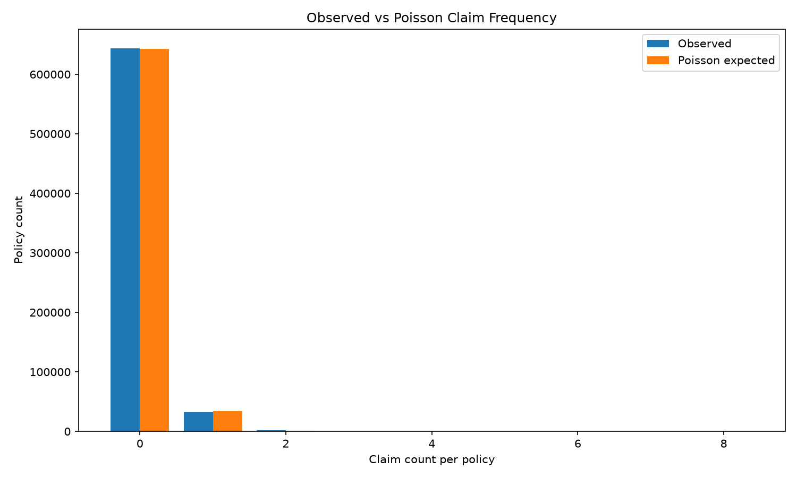

Comparison of observed claim counts per policy exposure-year against expected counts from the fitted Poisson frequency model.

### Figure 2. Claim Severity Distribution

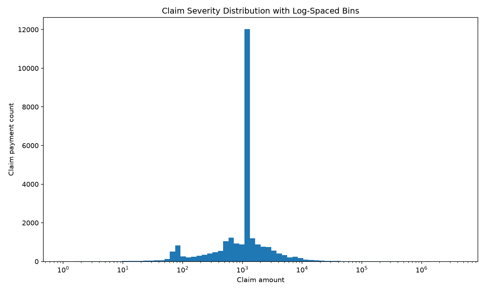

Distribution of observed claim payments using log-spaced bins. The distribution is highly right-skewed, which is typical of insurance severity data.

### Figure 3. Observed Severity vs. Fitted Distributions

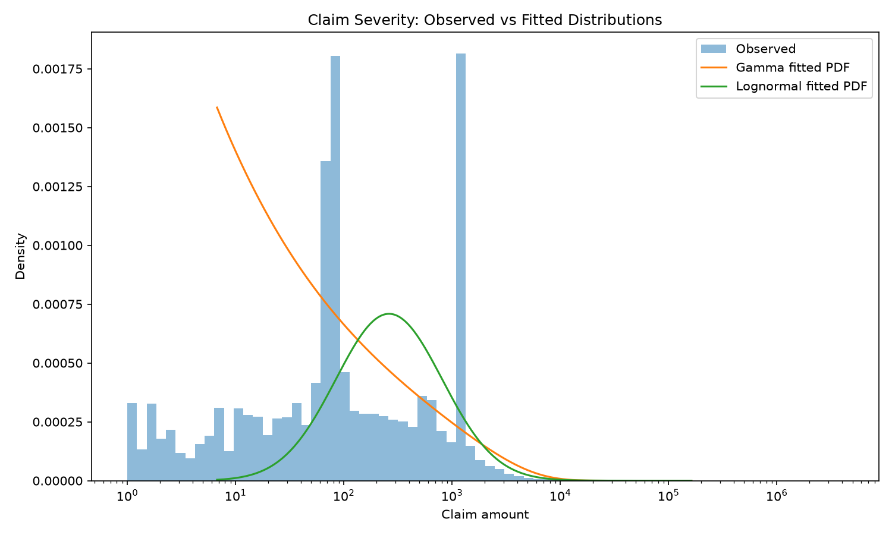

Observed claim severity compared with fitted Gamma and Lognormal probability density functions.

### Figure 4. Empirical CDF of Claim Severity

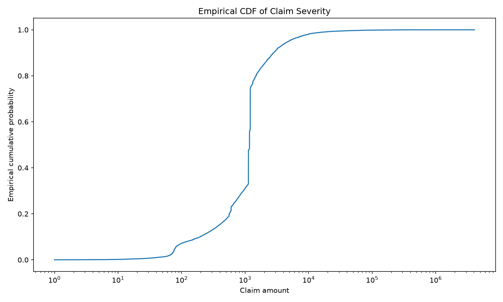

Empirical cumulative distribution of claim payments, showing the concentration of smaller claims and the long right tail of large losses.

### Figure 5. Lognormal Severity QQ Plot

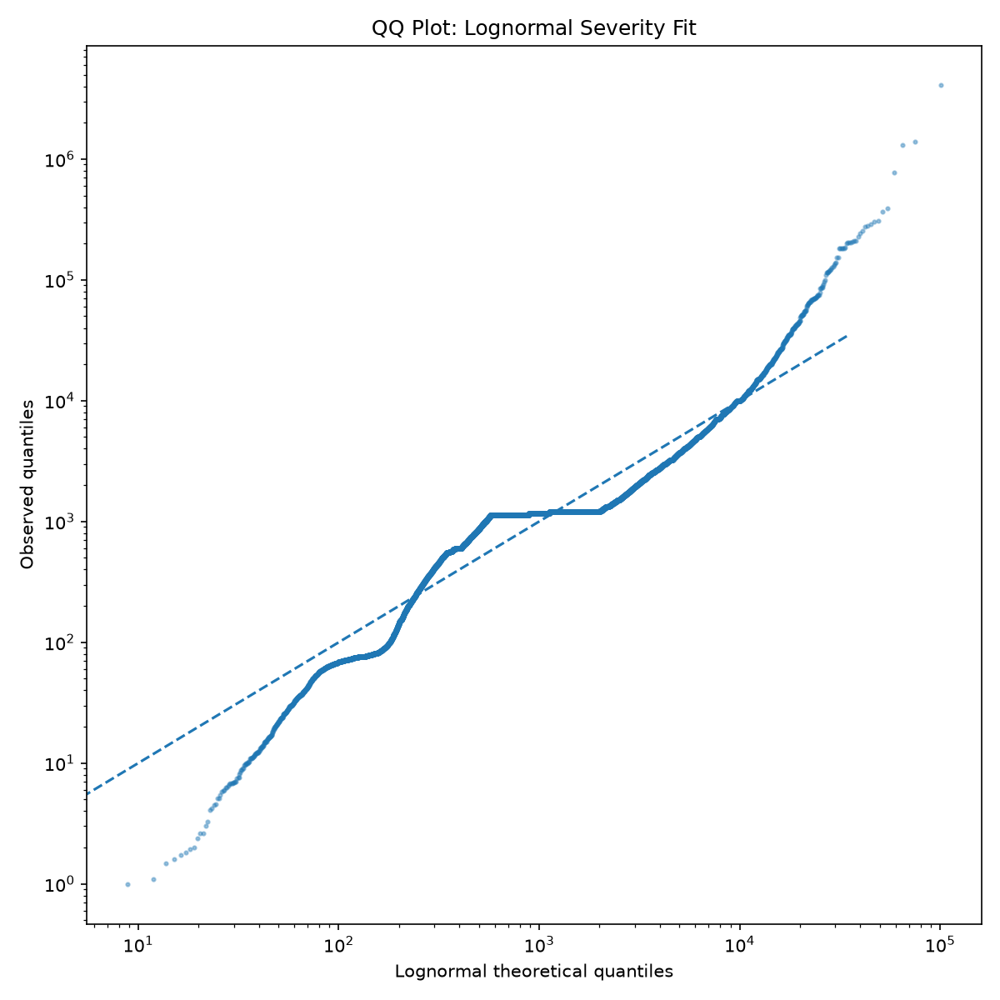

QQ plot comparing observed claim payments with the fitted Lognormal severity model.

### Figure 6. Gamma Severity QQ Plot

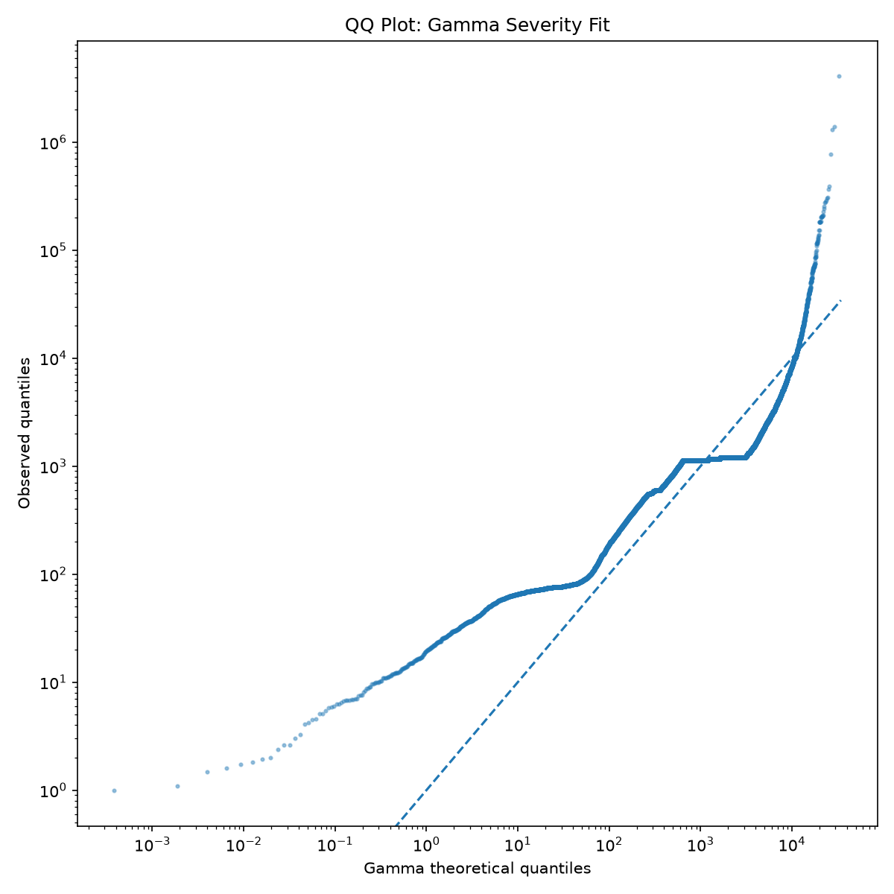

QQ plot comparing observed claim payments with the fitted Gamma severity model.

### Figure 7. Simulated Annual Loss Distribution

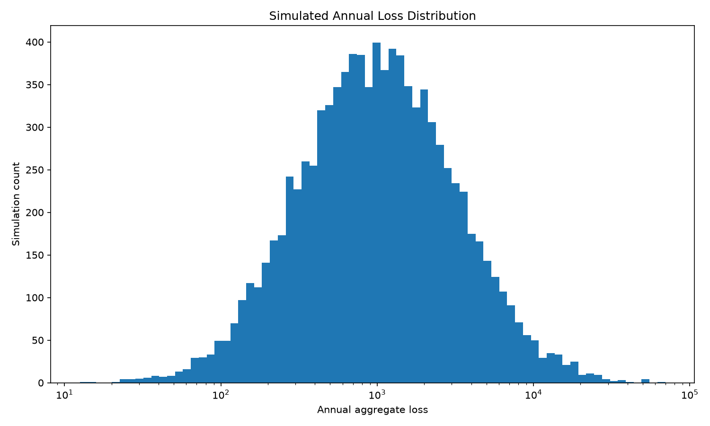

Monte Carlo distribution of annual aggregate loss for one insured exposure-year.

### Figure 8. Simulated Annual Loss ECDF

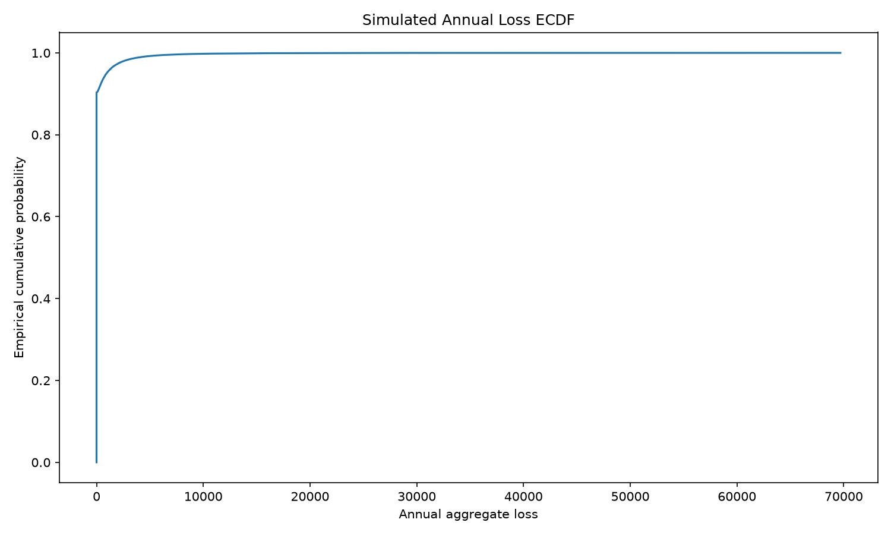

Empirical CDF of simulated annual losses for one insured exposure-year. The large jump at zero reflects the high probability of no claims.

### Figure 9. Expected Pure Premium by Economic Scenario

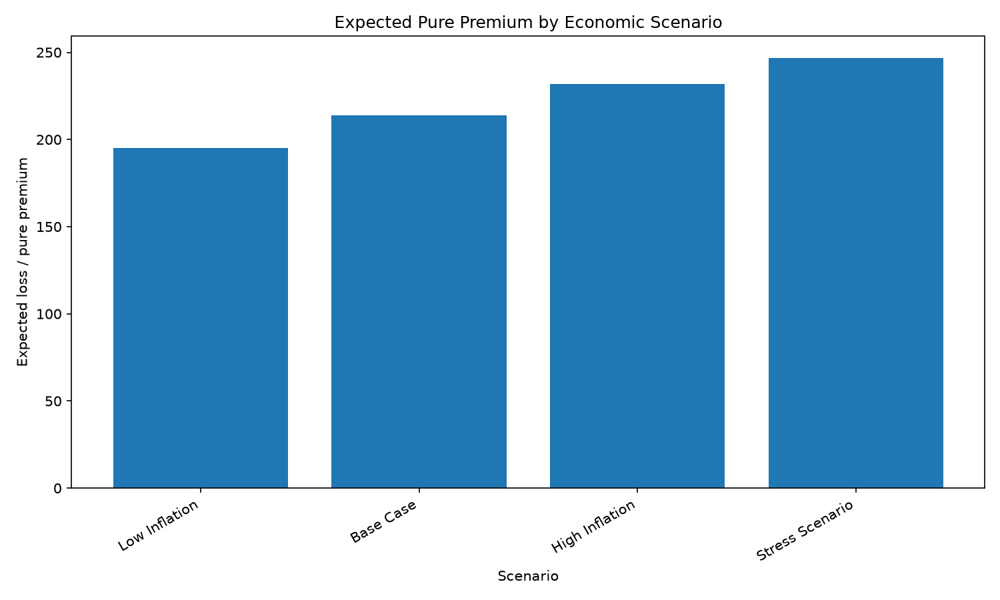

Scenario-based pricing comparison showing how expected pure premium changes under different inflation and trend assumptions.

### Figure 10. Pricing VaR by Economic Scenario

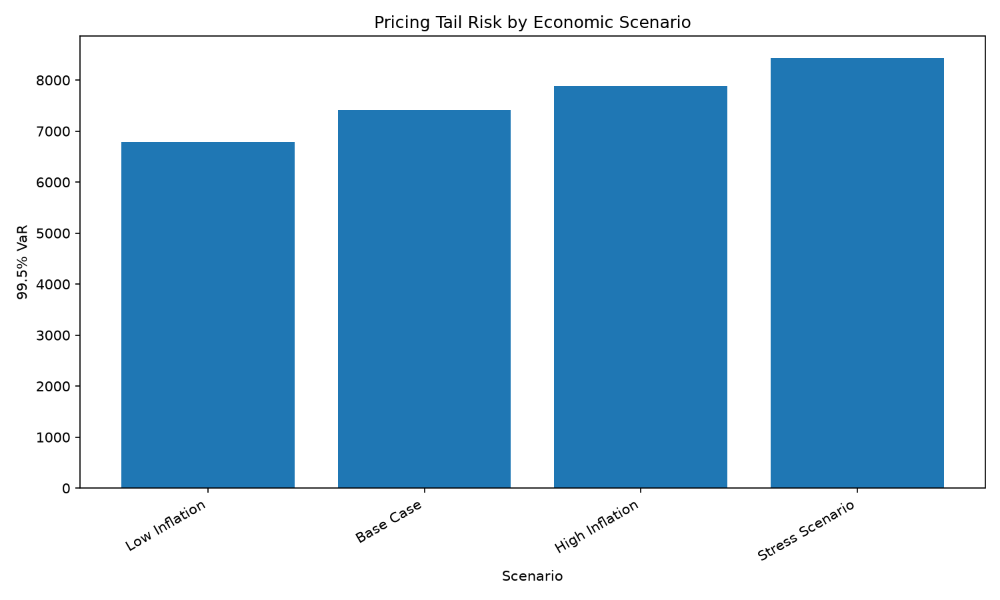

Comparison of 99.5% Value-at-Risk across economic scenarios for one insured exposure-year.

### Figure 11. Pricing CVaR by Economic Scenario

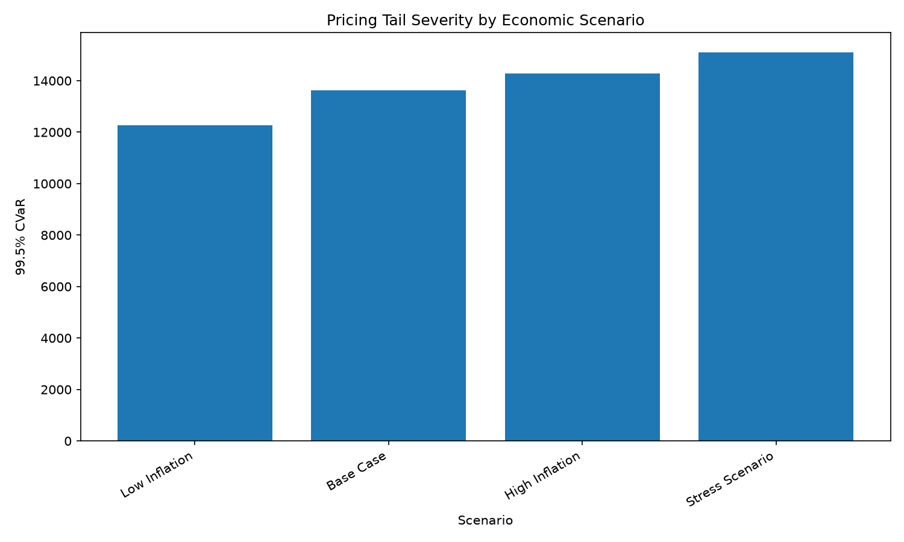

Comparison of 99.5% Conditional Value-at-Risk across economic scenarios, showing expected loss severity in the extreme tail.

## Tables

- `tables/frequency_model_summary.csv`
- `tables/frequency_observed_vs_poisson.csv`
- `tables/severity_summary.csv`
- `tables/simulation_summary.csv`
- `tables/simulation_percentiles.csv`
- `tables/simulation_results_sample.csv`
- `tables/pricing_scenario_summary.csv`
- `tables/pricing_scenario_percentiles.csv`

## Model Artifacts

- `model_artifacts/candidate_models.csv`
- `model_artifacts/selected_frequency_severity_model.csv`
